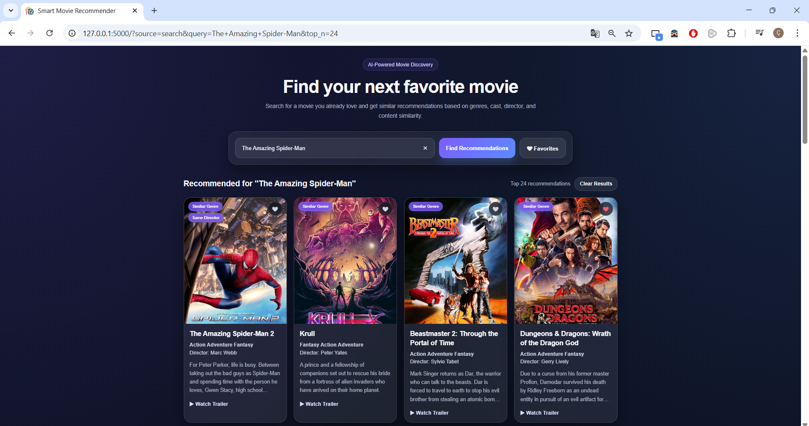
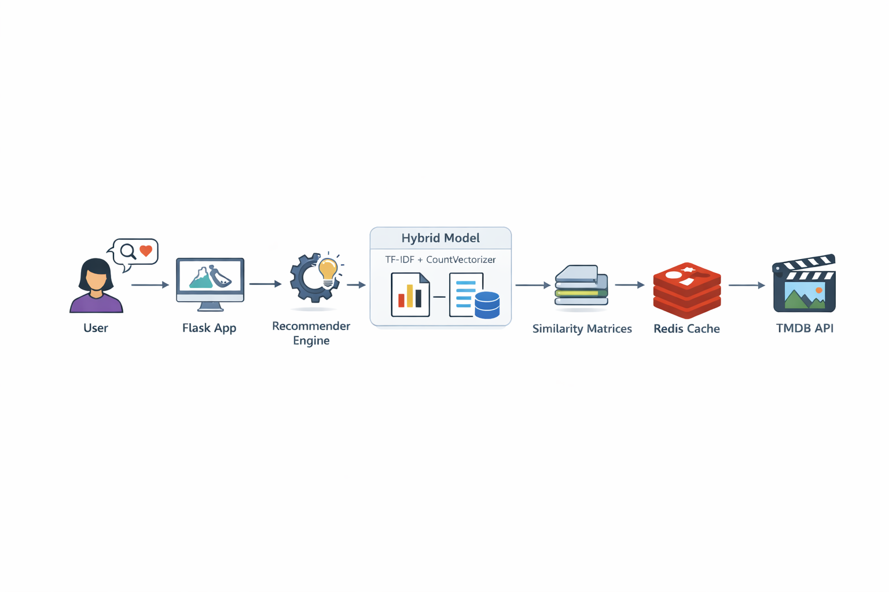
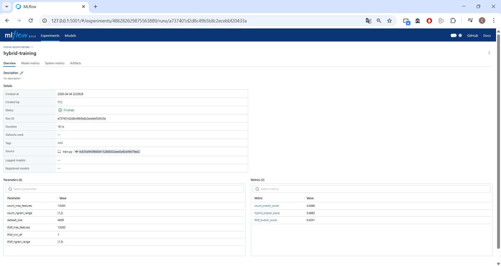

<a id="readme-top"></a>
<p align="center">
  
</p>

<h1 align="center">Smart Movie Recommender App</h1>

<p align="center">
  AI-powered movie recommendation system with hybrid modeling, personalization, and modern UI.
</p>
<br>

## Table of Contents

1. [Overview](#overview)  
2. [Key Features](#key-features)  
3. [Getting Started](#getting-started)  
   - [Prerequisites](#prerequisites)  
4. [Usage](#usage)  
5. [Technical Details](#technical-details)  
   - [Dependencies](#dependencies)  
   - [Dataset & Model](#dataset--model)  
   - [Evaluation Results](#evaluation-results)  
   - [Cache Behavior](#cache-behavior)  
   - [MLflow Tracking](#mlflow-tracking)  
   - [Supporting Files](#supporting-files)  
6. [Folder Structure](#folder-structure)  
7. [License](#license)

<p align="right">(<a href="#readme-top">back to top</a>)</p>
<br>

## Overview

This project is a movie recommendation system that suggests similar movies based on content.

It combines multiple techniques:

- Hybrid recommendation (TF-IDF + CountVectorizer)
- Dynamic weighting based on movie content
- Personalized recommendations using favorites
- Fast responses with caching
- MLflow experiment tracking
- Docker-based deployment

Designed as a production-ready system that can run seamlessly in both local and containerized environments.

<p align="right">(<a href="#readme-top">back to top</a>)</p>
<br>

## Application Screenshot

<p align="center">
  
</p>

<p align="center">
  Main interface showing movie search, recommendations, and favorite actions.
</p>

<p align="right">(<a href="#readme-top">back to top</a>)</p>
<br>

## System Architecture

<p align="center">
  
</p>

<p align="center">
  End-to-end pipeline including data processing, hybrid recommendation models, caching layer, and web interface.
</p>

<p align="right">(<a href="#readme-top">back to top</a>)</p>
<br>

## Key Features

| **Functionality**            | **Details** |
|-----------------------------|-------------|
| **Hybrid Recommendation**   | Combines TF-IDF and CountVectorizer models for improved accuracy. |
| **Dynamic Weighting**       | Adjusts model importance based on movie metadata richness. |
| **Personalized Results**    | Generates recommendations based on user favorites. |
| **Explainability**          | Provides “why recommended” tags (genre, director, franchise). |
| **Caching System**          | Uses Redis and Flask-Caching for faster responses. |
| **Movie Posters**           | Fetches posters via the TMDB API. |
| **Web Interface**           | Modern responsive UI built with Flask templates. |
| **Autocomplete Search**     | Suggests movie titles dynamically while typing. |
| **MLflow Tracking**         | Tracks model parameters, metrics, and experiments. |
| **Docker Support**          | Containerized deployment with Docker and docker-compose. |
| **Dataset Integration**     | Uses TMDB datasets (`tmdb_5000_movies.csv`, `tmdb_5000_credits.csv`). |

<p align="right">(<a href="#readme-top">back to top</a>)</p>
<br>

## Getting Started

### Prerequisites

- Python 3.10+
- pip
- Docker (optional)

Install dependencies:

```bash
pip install -r requirements.txt
```

Train models:

```bash
python train.py
```

Run the app:

```bash
python app.py
```

Or with Docker:

```bash
docker-compose up --build
```

<p align="right">(<a href="#readme-top">back to top</a>)</p>
<br>

## Usage

- Search a movie  
- Get recommendations  
- Add/remove favorites  
- Generate personalized recommendations  

<p align="right">(<a href="#readme-top">back to top</a>)</p>
<br>

## Technical Details

### Dependencies

- Flask  
- pandas  
- numpy  
- scikit-learn  
- requests  
- MLflow  
- Redis  

<p align="right">(<a href="#readme-top">back to top</a>)</p>
<br>

### Dataset & Model

This project uses **The Movies Dataset (TMDB)**:

- `tmdb_5000_movies.csv` → movie metadata  
- `tmdb_5000_credits.csv` → cast & crew  

> **Dataset Source:** [Kaggle - TMDB Movie Metadata](https://www.kaggle.com/datasets/tmdb/tmdb-movie-metadata?resource=download)

#### Similarity Computation

- Text features are combined into a single **content column**
- Includes:
  - genres
  - cast
  - director
  - overview

Models used:

**TF-IDF**
- ngram_range: (1,3)
- max_features: 5000

**CountVectorizer**
- ngram_range: (1,2)
- max_features: 10000

Similarity is computed using **cosine similarity**.

<p align="right">(<a href="#readme-top">back to top</a>)</p>
<br>

### Evaluation Results

Custom evaluation based on:

- Genre similarity (50%)  
- Director match (30%)  
- Cast similarity (20%)  

Models compared:

- TF-IDF  
- CountVectorizer  
- Hybrid model (best performance)  

<p align="right">(<a href="#readme-top">back to top</a>)</p>
<br>

### Cache Behavior

The application uses Redis cache when Redis is available.  
If Redis is not reachable, it automatically falls back to `SimpleCache`, allowing both local development and Docker-based execution without manual configuration changes.

<p align="right">(<a href="#readme-top">back to top</a>)</p>
<br>

### MLflow Tracking

Run MLflow:

```bash
mlflow ui --port 5001
```

Open:
```
http://127.0.0.1:5001
```

<p align="center">
  
</p>

<p align="center">
  Model experiments, parameters, and metrics tracked using MLflow.
</p>

<p align="right">(<a href="#readme-top">back to top</a>)</p>
<br>

### Supporting Files

- `app.py` → main Flask app  
- `recommender.py` → recommendation logic  
- `train.py` → model training  
- `evaluate.py` → evaluation logic  
- `requirements.txt` → dependencies  

<p align="right">(<a href="#readme-top">back to top</a>)</p>
<br>

## Folder Structure

```
project/
│
├── app.py
├── recommender.py
├── train.py
├── evaluate.py
│
├── artifacts/
├── data/
│
├── templates/
│   ├── index.html
│   └── favorites.html
│
├── static/
│   └── screenshots/
│
├── docker-compose.yml
├── Dockerfile
├── requirements.txt
```

<p align="right">(<a href="#readme-top">back to top</a>)</p>
<br>

## License

This project is licensed under the MIT License.  
See the [LICENSE](LICENSE) file for details.

<p align="right">(<a href="#readme-top">back to top</a>)</p>