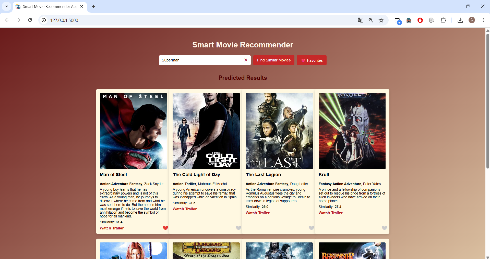
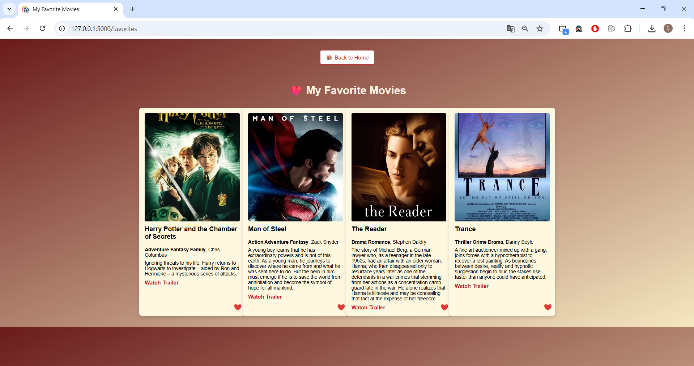

<a id="readme-top"></a>
<p align="center">
  
</p>

<h1 align="center">Smart Movie Recommender App</h1>

<p align="center">
  An AI-powered movie recommendation system that suggests similar movies based on content features.  
  Built with Flask and machine learning models, this app delivers an interactive and user-friendly movie discovery experience.
</p>
</br>


## Table of Contents

1. [Overview](#overview)  
2. [Key Features](#key-features)  
3. [Getting Started](#getting-started)  
   - [Prerequisites](#prerequisites)  
4. [Usage](#usage)  
5. [Technical Details](#technical-details)  
   - [Dependencies](#dependencies)  
   - [Dataset & Model](#dataset--model)  
   - [Evaluation Results](#evaluation-results)  
   - [Supporting Files](#supporting-files)  
6. [Folder Structure](#folder-structure)  
7. [License](#license)

<p align="right">(<a href="#readme-top">back to top</a>)</p>
<br>


## Overview

**Smart Movie Recommender App** uses content-based filtering to recommend movies similar to a user-selected title.  
It utilizes **TMDB datasets** and advanced NLP techniques (TF-IDF or embeddings) to compute movie similarities.

Users can:
- Select a **movie title** from the list.
- Get a list of **top similar movies** along with posters and details.

## Application Screenshots
<p align="center">
  
  <br>
  <em>Homepage – Movie search and recommendation input page</em>
</p>
<br>
<p align="center">
  
  <br>
  <em>Favorites Page – List of saved favorite movies</em>
</p>

<p align="right">(<a href="#readme-top">back to top</a>)</p>
<br>


## Key Features

| **Functionality**            | **Details** |
|------------------------------|-------------|
| **Content-based Filtering**  | Recommends movies based on textual similarity (overview, genres, cast, etc.). |
| **Movie Posters**            | Fetches posters via the TMDB API. |
| **Web Interface**            | Built with Flask templates for a smooth UX. |
| **Efficient Similarity**     | Uses TF-IDF or cosine similarity for fast recommendations. |
| **CSV Data Integration**     | Reads movie metadata from `tmdb_5000_movies.csv` and `tmdb_5000_credits.csv`. |

<p align="right">(<a href="#readme-top">back to top</a>)</p>
<br>


## Getting Started

To run **Smart Movie Recommender App** locally:

- Ensure **Python 3.10 or later** is installed.  
- Check that `pip` is available.

<br>

### Prerequisites

Install all dependencies from `requirements.txt`:
```bash
pip install -r requirements.txt
```

<p align="right">(<a href="#readme-top">back to top</a>)</p>
<br>


## Usage

1. **Clone the repository and install dependencies:**
   ```bash
   pip install -r requirements.txt
   ```

2. **Run the Flask app:**
   ```bash
   python app.py
   ```

3. **Stop the server:**
   ```bash
   CTRL+C
   ```

Then visit **http://127.0.0.1:5000** in your browser.

<p align="right">(<a href="#readme-top">back to top</a>)</p>
<br>


## Technical Details

### Dependencies
- Flask  
- pandas  
- numpy  
- scikit-learn  
- requests  

> Tested with Python 3.10 and Flask 2.3.2

<p align="right">(<a href="#readme-top">back to top</a>)</p>
<br>


### Dataset & Model

This project uses **The Movies Dataset (TMDB)** containing detailed metadata about 5000 movies:
- **tmdb_5000_movies.csv** – Movie metadata (title, overview, genres, etc.).
- **tmdb_5000_credits.csv** – Cast and crew details.

> **Dataset Source:** [Kaggle - TMDB Movie Metadata](https://www.kaggle.com/datasets/tmdb/tmdb-movie-metadata?resource=download)

**Similarity Computation:**
- Text features are combined into a single **content column** (overview, genres, keywords).
- TF-IDF Vectorizer is applied with `ngram_range=(1,2)` and `max_features=10,000`.
- Cosine similarity is calculated for movie matching.

<p align="right">(<a href="#readme-top">back to top</a>)</p>
<br>


### Supporting Files

- **app.py** – Flask application entry point.  
- **movies.csv** – Preprocessed movie data (optional).  
- **requirements.txt** – Dependencies list.  
- **tmdb_5000_movies.csv** – Movie dataset.  
- **tmdb_5000_credits.csv** – Credits dataset.

<p align="right">(<a href="#readme-top">back to top</a>)</p>
<br>


## Folder Structure
```
Movie_Recommender_App/
│
├── app.py
├── movies.csv
├── tmdb_5000_movies.csv
├── tmdb_5000_credits.csv
├── requirements.txt
├── templates/
│   └── index.html
├── static/
│   └── favicon.png
```

<p align="right">(<a href="#readme-top">back to top</a>)</p>
<br>


## License

This project is licensed under the MIT License.  
See the [LICENSE](LICENSE) file for details.

<p align="right">(<a href="#readme-top">back to top</a>)</p>
